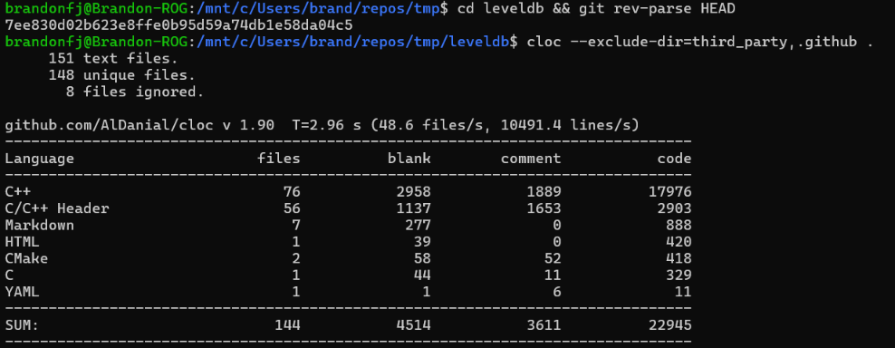

# Selección del proyecto C++ - Doxygen

- **Nombre:** LevelDB
- **Descripción breve:** Motor de almacenamiento clave-valor embebido, desarrollado por Google, que implementa un árbol LSM (Log-Structured Merge-Tree) con ordenamiento de claves, compactación en segundo plano y soporte para snapshots e iteración ordenada.
- **URL del repositorio original:** https://github.com/google/leveldb
- **Licencia:** BSD 3-Clause
- **Lenguaje principal:** C++
- **Commit exacto analizado:** `7ee830d02b623e8ffe0b95d59a74db1e58da04c5` (obtenido con `git rev-parse HEAD`)
- **Cantidad de archivos y líneas de código relevantes:** 132 archivos fuente relevantes (76 `.cc` + 56 `.h`), con 20 879 líneas de código (17 976 en C++ y 2 903 en encabezados C/C++), sin contar `third_party` ni archivos de CI.
- **Comando utilizado para obtener las métricas:**

```bash
git clone --depth 1 https://github.com/google/leveldb.git
cd leveldb
git rev-parse HEAD
cloc --exclude-dir=third_party,.github .
```

Salida obtenida:

```text
Language                     files          blank        comment           code
-------------------------------------------------------------------------------
C++                             76           2958           1889          17976
C/C++ Header                    56           1137           1653           2903
Markdown                         7            277              0            888
HTML                             1             39              0            420
CMake                            2             58             52            418
C                                1             44             11            329
YAML                             1              1              6             11
-------------------------------------------------------------------------------
SUM:                           144           4514           3611          22945
```


- **Razón por la cual el proyecto es apropiado para Doxygen:** LevelDB es una biblioteca C++ pura, orientada a objetos, con una API pública claramente separada en `include/leveldb/` y una implementación interna organizada en `db/`, `table/` y `util/`. Esta separación entre interfaz y detalle de implementación es justamente el escenario que Doxygen documenta mejor, generando referencia de clases, jerarquías y grafos de colaboración a partir de los encabezados públicos.
- **Presencia y calidad inicial de comentarios Doxygen:** El proyecto no utiliza el formato formal `/** ... */` ni `///` que Doxygen reconoce por defecto. En su lugar, usa comentarios de línea `//` descriptivos ubicados antes de cada método público (por ejemplo, en `include/leveldb/db.h`), explicando en prosa el comportamiento, los parámetros y las condiciones de error. La calidad del contenido es alta, pero el formato no es directamente compatible con Doxygen sin ajustes de configuración.
- **Dependencias o dificultades previstas para generar la documentación:**
  - Será necesario habilitar `JAVADOC_AUTOBRIEF = YES` (o una configuración equivalente) en el `Doxyfile` para que Doxygen interprete los comentarios `//` existentes como descripciones, ya que de lo contrario la documentación de la API se generará sin texto explicativo.
  - Se requiere Graphviz instalado para generar los diagramas de colaboración y de herencia entre clases (`DB`, `DBImpl`, `Iterator`, `WriteBatch`, etc.).
  - El código depende de `<atomic>`, `<deque>` y otras cabeceras estándar de C++, por lo que deberá configurarse correctamente el `INCLUDE_PATH` para que Doxygen resuelva las inclusiones internas del proyecto (`db/`, `table/`, `util/`) al generar el análisis cruzado.
  - Se excluirá el directorio `third_party` del análisis, ya que corresponde a dependencias externas y no a código propio del proyecto.