### M1.1 - Commits de Git

**Objetivo:** Hacer dos commits consecutivos sobre la rama `main`.

**Estado inicial:** La rama `main` se encuentra en el commit `C1`.

| Paso | Comando | Efecto sobre el repositorio |
|---:|---|---|
| 1 | `git commit` | Se crea el commit `C2` a partir de `C1`. La rama `main` avanza y ahora apunta a `C2`. |
| 2 | `git commit` | Se crea el commit `C3` a partir de `C2`. La rama `main` avanza y ahora apunta a `C3`. |

**Estado final:** La rama `main` se encuentra en el commit `C3`, después de haber creado dos nuevos commits.

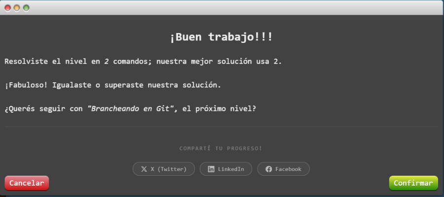

**Aprendizaje:** Aprendí que cada `git commit` crea un nuevo punto en el historial y hace avanzar la rama que está activa.

### M1.2 - Brancheando en Git

**Objetivo:** Crear una rama llamada `bugFix` y cambiarse a ella mediante `checkout`.

**Estado inicial:** La rama `main` se encuentra en el commit `C1`.

| Paso | Comando | Efecto sobre el repositorio |
|---:|---|---|
| 1 | `git branch bugFix` | Se crea la rama `bugFix`, apuntando inicialmente al commit `C1`. No se crea un nuevo commit. |
| 2 | `git checkout bugFix` | `HEAD` y la rama activa pasan a `bugFix`. La rama `bugFix` permanece apuntando al commit `C1`. |

**Estado final:** La rama `bugFix` existe y es la rama activa. Tanto `main` como `bugFix` apuntan al commit `C1`.

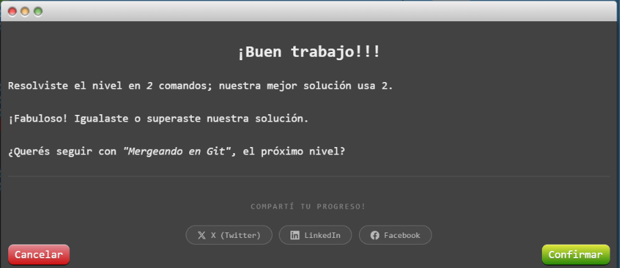
**Aprendizaje:** Aprendí que crear una rama con `git branch` no crea un nuevo commit, sino que crea una referencia al commit actual. Además, `git checkout` permite cambiar la rama activa.

### M1.3 - Mergeando en Git

**Objetivo:** Crear una rama llamada `bugFix`, realizar un commit en ella, volver a `main`, realizar otro commit y finalmente fusionar `bugFix` con `main` mediante `git merge`.

**Estado inicial:** La rama `main` se encuentra en el commit `C1`.

| Paso | Comando | Efecto sobre el repositorio |
|---:|---|---|
| 1 | `git branch bugFix` | Se crea la rama `bugFix` apuntando al commit `C1`. No se crea un nuevo commit. |
| 2 | `git checkout bugFix` | Se cambia la rama activa de `main` a `bugFix`. `HEAD` pasa a apuntar a `bugFix`. |
| 3 | `git commit` | Se crea un nuevo commit sobre `bugFix`. La rama `bugFix` avanza al nuevo commit. |
| 4 | `git checkout main` | Se cambia nuevamente a la rama `main`. `HEAD` pasa a apuntar a `main`, que todavía se encuentra en `C1`. |
| 5 | `git commit` | Se crea un nuevo commit sobre `main`. La rama `main` avanza al nuevo commit. |
| 6 | `git merge bugFix` | Se fusionan los cambios de `bugFix` con `main`. Debido a que ambas ramas tienen commits diferentes desde `C1`, Git crea un nuevo commit de merge con dos padres. |

**Estado final:** La rama `main` contiene tanto el commit realizado en `bugFix` como el commit realizado directamente sobre `main`. El historial presenta un commit de merge que integra ambas ramas.

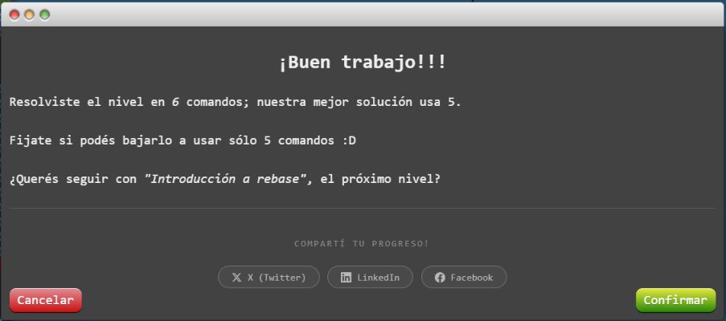
**Aprendizaje:** Aprendí que `git merge` permite integrar los cambios de dos ramas y que, cuando ambas tienen commits diferentes, se puede generar un nuevo commit de merge que conserva ambas líneas de trabajo.

### M1.4 - Git Rebase

**Objetivo:** Crear una rama `bugFix`, realizar un commit en ella, realizar otro commit en `main` y finalmente utilizar `git rebase` para colocar el commit de `bugFix` encima de `main`.

**Estado inicial:** La rama `main` se encuentra en el commit `C0`.

| Paso | Comando | Efecto sobre el repositorio |
|---:|---|---|
| 1 | `git branch bugFix` | Se crea la rama `bugFix` apuntando al commit `C0`. No se crea un nuevo commit. |
| 2 | `git checkout bugFix` | Se cambia la rama activa de `main` a `bugFix`. `HEAD` pasa a apuntar a `bugFix`. |
| 3 | `git commit` | Se crea un nuevo commit sobre `bugFix`. La rama `bugFix` avanza al nuevo commit. |
| 4 | `git checkout main` | Se cambia nuevamente a la rama `main`. `HEAD` pasa a apuntar a `main`, que continúa en `C0`. |
| 5 | `git commit` | Se crea un nuevo commit sobre `main`. La rama `main` avanza al nuevo commit. |
| 6 | `git checkout bugFix` | Se cambia nuevamente a la rama `bugFix`. |
| 7 | `git rebase main` | Se toma el commit realizado en `bugFix` y se vuelve a aplicar sobre el último commit de `main`. De esta forma, el historial de `bugFix` queda lineal y su commit queda encima de `main`. |

**Estado final:** La rama `main` contiene su nuevo commit y la rama `bugFix` se encuentra un commit por encima de `main`, con el trabajo de `bugFix` reaplicado sobre la versión más reciente de `main`.

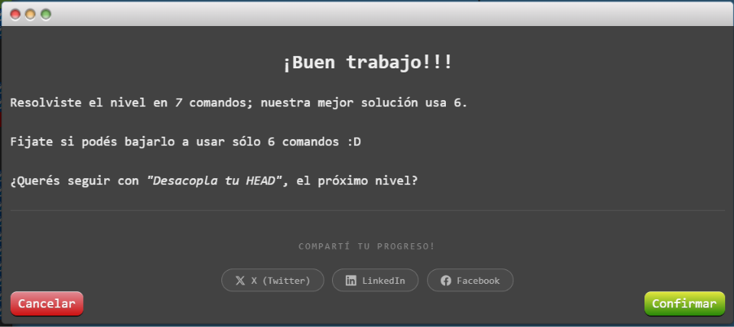
**Aprendizaje:** Aprendí que `git rebase` permite colocar los commits de una rama sobre otra, reorganizando el historial para mantener una estructura más lineal.

### M2.1 - Moviéndose por ahí con Git

**Objetivo:** Desacoplar `HEAD` de la rama `bugFix` y adjuntarlo directamente al commit `C4`, especificando el commit mediante su hash.

**Estado inicial:** `HEAD` se encuentra asociado a la rama `bugFix`.

| Paso | Comando | Efecto sobre el repositorio |
|---:|---|---|
| 1 | `git checkout C4` | `HEAD` se mueve directamente al commit `C4`, quedando desacoplado de la rama `bugFix`. |

**Estado final:** `HEAD` queda desacoplado (*detached HEAD*) y apunta directamente al commit `C4`, mientras que la rama `bugFix` permanece en su posición original.

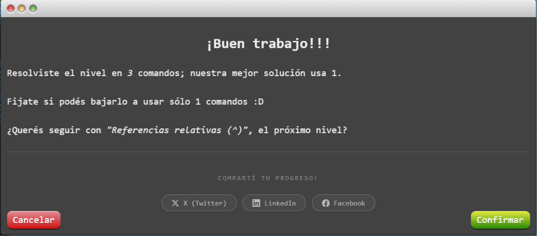
**Aprendizaje:** Aprendí que `HEAD` puede quedar desacoplado de una rama al moverse directamente a un commit, lo que permite consultar o trabajar temporalmente desde ese punto.

### M2.2 - Referencias relativas

**Objetivo:** Hacer checkout del padre del commit donde se encuentra `bugFix`, utilizando una referencia relativa para desacoplar `HEAD`.

**Estado inicial:** `HEAD` se encuentra en la punta de la rama `bugFix`.

| Paso | Comando | Efecto sobre el repositorio |
|---:|---|---|
| 1 | `git checkout HEAD^` | `HEAD` se mueve al commit padre del commit actual. Al no apuntar a una rama, `HEAD` queda desacoplado. |

**Estado final:** `HEAD` se encuentra en el commit padre del commit donde estaba `bugFix` y queda en estado *detached HEAD*. La rama `bugFix` permanece en su posición original.

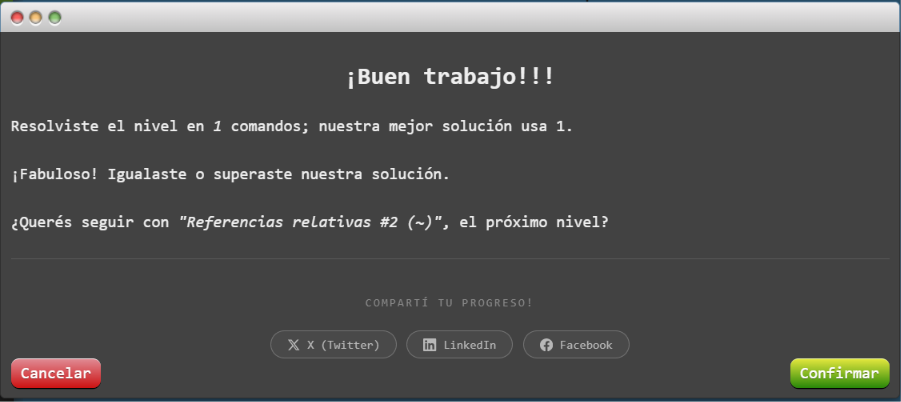
**Aprendizaje:** Aprendí a utilizar referencias relativas como `HEAD^` para moverme al commit padre sin tener que conocer directamente su hash.

### M2.3 - El operador "~"

**Objetivo:** Mover `HEAD`, `main` y `bugFix` a sus posiciones finales utilizando referencias y movimientos de ramas.

**Estado inicial:** La rama `bugFix` se encuentra en el commit `C5`. `HEAD` se encuentra en el commit `C2`, por lo que el directorio de trabajo refleja dicho commit. La rama `main` se encuentra en el commit `C4`.

| Paso | Comando | Efecto sobre el repositorio |
|---:|---|---|
| 1 | `git branch -f bugFix C0` | Fuerza el movimiento de la rama `bugFix` para que apunte al commit `C0`. |
| 2 | `git checkout HEAD^` | `HEAD` se mueve desde `C2` hacia su commit padre, `C1`, quedando desacoplado. |
| 3 | `git branch -f main C6` | Fuerza el movimiento de la rama `main` para que apunte al commit `C6`. |

**Estado final:** La rama `bugFix` apunta al commit `C0`, `HEAD` apunta al commit `C1` y la rama `main` apunta al commit `C6`.

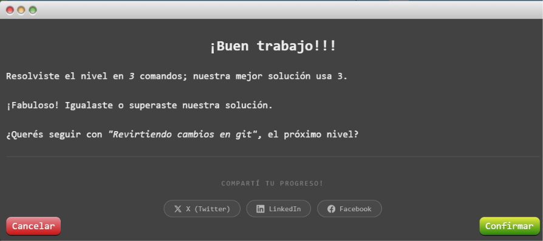
**Aprendizaje:** Aprendí que `git branch -f` permite mover una rama directamente a un commit específico y que las referencias relativas pueden facilitar estos movimientos dentro del historial.

### M2.4 - Revirtiendo cambios en Git

**Objetivo:** Revertir el commit más reciente tanto en la rama local como en la rama remota `pushed`, utilizando un método apropiado para cada caso.

**Estado inicial:** La rama `main` se encuentra en el commit `C1`, la rama remota `pushed` se encuentra en `C2` y la rama local `local` se encuentra en `C3`.

| Paso | Comando | Efecto sobre el repositorio |
|---:|---|---|
| 1 | `git reset HEAD~1` | La referencia `HEAD` y la rama local se mueven un commit hacia atrás, eliminando el commit más reciente de la historia local. |
| 2 | `git checkout pushed` | Se cambia la rama activa a `pushed`. |
| 3 | `git revert HEAD` | Se crea un nuevo commit que revierte los cambios introducidos por el commit actual, manteniendo el historial existente de la rama `pushed`. |

**Estado final:** El commit más reciente de la rama local fue eliminado mediante `reset`, mientras que el cambio más reciente de la rama `pushed` fue revertido mediante un nuevo commit creado con `git revert`.

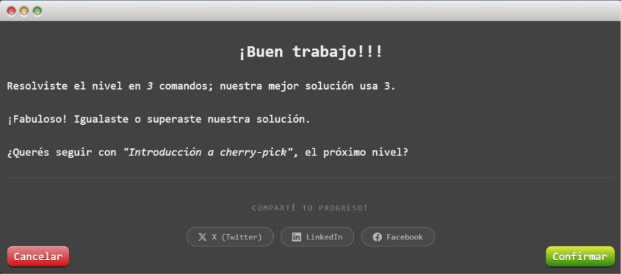

**Aprendizaje:** Aprendí la diferencia entre `git reset` y `git revert`: `reset` modifica la posición de la rama en el historial local, mientras que `revert` crea un nuevo commit para deshacer cambios sin eliminar el historial existente.

### M3.1 - Introducción a cherry-pick

**Objetivo:** Copiar a la rama `main` los commits seleccionados de las otras ramas, específicamente los commits `C3`, `C4` y `C7`.

**Estado inicial:** El commit `C0` es el commit inicial. Desde `C1` se bifurcan tres ramas:

- `bugFix` avanza desde `C1` hasta `C2` y luego `C3`.
- `side` avanza desde `C1` hasta `C4` y luego `C5`.
- `another` avanza desde `C1` hasta `C6` y luego `C7`.
- La rama `main` se encuentra en `C1`.

| Paso | Comando | Efecto sobre el repositorio |
|---:|---|---|
| 1 | `git cherry-pick C3 C4 C7` | Copia los cambios de los commits `C3`, `C4` y `C7` y los aplica sobre la rama `main`, creando nuevos commits en `main` con esos cambios. |

**Estado final:** La rama `main` contiene los cambios correspondientes a los commits `C3`, `C4` y `C7`, aplicados mediante `cherry-pick` en el orden indicado.

**Aprendizaje:** Aprendí que `git cherry-pick` permite seleccionar commits específicos de otras ramas y aplicar sus cambios en la rama actual, sin necesidad de fusionar toda la rama.

### M3.2 - Introducción al rebase interactivo

**Objetivo:** Realizar un rebase interactivo para modificar el orden de los commits y alcanzar el orden mostrado en la visualización objetivo.

**Estado inicial:** La cadena de commits es lineal: `C0 → C1 → C2 → C3 → C4 → C5`. La rama `main` se encuentra en `C5` y `HEAD` está acoplado a `main`. El marcador `overHere` señala el commit `C1`.

| Paso | Comando | Efecto sobre el repositorio |
|---:|---|---|
| 1 | `git rebase -i C1` | Inicia un rebase interactivo tomando `C1` como punto de referencia y permite modificar el orden de los commits posteriores. |
| 2 | Selección manual del orden requerido | Se reorganizan los commits durante el rebase para obtener el orden solicitado por el nivel, omitiendo el commit `C2`. |

**Estado final:** A partir de `C1`, se conservan los commits `C3`, `C5` y `C4` en ese orden, mientras que `C2` se omite. La rama `main` queda ubicada sobre la nueva cadena de commits.

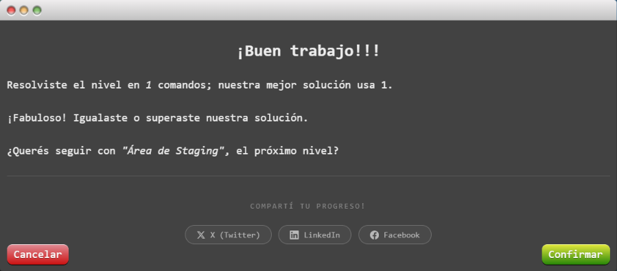
**Aprendizaje:** Aprendí a utilizar el rebase interactivo para modificar el orden de los commits. Una de las complicaciones fue entender que al omitir un commit, la historia resultante cambia y es necesario revisar cuidadosamente el orden solicitado.

### M3.3 - Área de Staging

**Objetivo:** Preparar y realizar dos commits separados, agregando primero `app.js` y después `styles.css`, de manera que cada commit contenga únicamente los cambios correspondientes a un archivo.

**Estado inicial:** Los commits `C0` y `C1` ya existen y la rama `main` se encuentra en `C1`. Los cambios de `app.js` y `styles.css` están disponibles para ser preparados y confirmados en commits separados.

| Paso | Comando | Efecto sobre el repositorio |
|---:|---|---|
| 1 | `git add app.js` | Agrega los cambios de `app.js` al área de staging, preparándolos para el siguiente commit. |
| 2 | `git commit` | Crea el commit `C2`, que contiene los cambios de `app.js`. |
| 3 | `git add styles.css` | Agrega los cambios de `styles.css` al área de staging. |
| 4 | `git commit` | Crea el commit `C3`, que contiene los cambios de `styles.css`. |

**Estado final:** La rama `main` se encuentra en `C3`. El commit `C2` contiene los cambios de `app.js` y el commit `C3` contiene los cambios de `styles.css`, manteniendo cada cambio en un commit independiente.

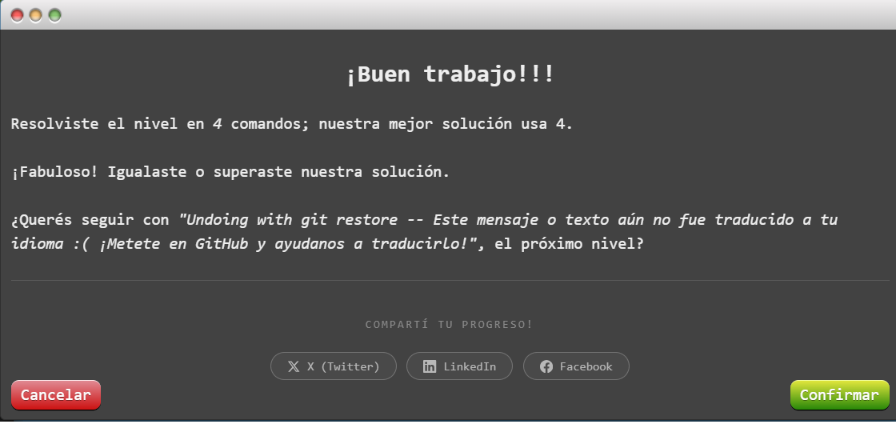
**Aprendizaje:** Aprendí la importancia del área de staging para mantener los commits organizados y separados. En este nivel fue necesario agregar cada archivo individualmente para evitar que los cambios terminaran mezclados en un mismo commit.

### M3.4 - Undoing with git restore

**Objetivo:** Organizar los cambios para conservar el trabajo de `app.js`, sacar `secret.env` del área de staging para dejarlo para un commit posterior y descartar completamente los cambios de `experiment.js`. Finalmente, realizar un commit únicamente con `app.js`.

**Estado inicial:** La rama `main` se encuentra en el commit `C1` y `HEAD` también apunta a `C1`.

En el Working Directory, `experiment.js` está modificado pero no está en staging.

En el Staging Area se encuentran los cambios de `app.js` y `secret.env`.

El commit `C1` todavía no contiene ninguno de estos cambios.

| Paso | Comando | Efecto sobre el repositorio |
|---:|---|---|
| 1 | `git restore --staged secret.env` | Retira `secret.env` del área de staging. Sus cambios permanecen en el Working Directory, pero ya no están preparados para el commit. |
| 2 | `git restore experiment.js` | Descarta los cambios realizados en `experiment.js` y restaura el archivo al estado del último commit. |
| 3 | `git commit` | Crea el commit `C2` utilizando los cambios que permanecen preparados en el área de staging, correspondientes únicamente a `app.js`. |

**Estado final:** La rama `main` se encuentra en el commit `C2` y `HEAD` apunta a `C2`.

El Working Directory contiene los cambios de `secret.env`, que fueron retirados del staging y todavía no forman parte de ningún commit.

El Staging Area queda limpio después del commit.

El commit `C2` contiene únicamente los cambios de `app.js`.

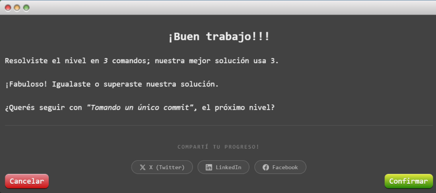

**Aprendizaje:** Aprendí la diferencia entre retirar un archivo del staging y descartar completamente sus cambios. Al principio puede ser fácil confundir `git restore --staged` con `git restore`, pero el primero conserva los cambios mientras que el segundo los elimina del Working Directory.

### M4.1 - Tomando un único commit

**Objetivo:** Utilizar un rebase interactivo para modificar la posición de un commit específico y posteriormente mover las ramas `main` y `bugFix` a la nueva versión del historial.

**Estado inicial:** La cadena de commits es lineal: `C0 → C1 → C2 → C3 → C4`.

Cada rama apunta a un commit distinto dentro de la secuencia:

- `main` se encuentra en `C1`.
- `debug` se encuentra en `C2`.
- `printf` se encuentra en `C3`.
- `bugFix` se encuentra en `C4`.
- `HEAD` está acoplado a `bugFix` y, por lo tanto, apunta a `C4`.

| Paso | Comando | Efecto sobre el repositorio |
|---:|---|---|
| 1 | `git rebase -i C1` | Inicia un rebase interactivo tomando `C1` como punto de referencia y permite modificar el historial de los commits posteriores. |
| 2 | `git rebase -i main` | Realiza el rebase interactivo utilizando la rama `main` como referencia. |
| 3 | `git rebase bugFix main` | Rebasea la rama `main` sobre `bugFix`, haciendo que `main` apunte a la nueva versión correspondiente del historial. |

**Estado final:** Desde `C1` se mantienen dos bifurcaciones. En una se encuentran los commits `C2` y `C3`, mientras que `C4` queda como un commit huérfano respecto a las ramas principales. La otra bifurcación contiene una nueva versión de `C4`, representada como `C4'`, y tanto `main` como `bugFix` apuntan a esta nueva versión.

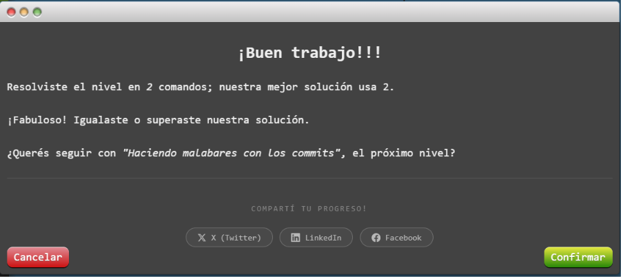
**Aprendizaje:** Aprendí que un rebase interactivo puede modificar la estructura del historial y que los commits pueden adquirir nuevas versiones cuando son reaplicados. Al principio puede resultar confuso seguir las distintas versiones de los commits, especialmente cuando aparecen con apóstrofes.

### M4.2 - Haciendo malabares con los commits

**Objetivo:** Reordenar temporalmente los commits mediante un rebase interactivo para modificar un commit anterior con `git commit --amend`, volver a colocar los commits en su orden original y finalmente mover `main` a la versión actualizada del historial.

**Estado inicial:** La secuencia de commits es lineal: `C0 → C1 → C2 → C3`.

Cada rama apunta a un commit distinto:

- `main` se encuentra en `C1`.
- `newImage` se encuentra en `C2`.
- `caption` se encuentra en `C3`.
- `HEAD` está acoplado a `caption` y apunta a `C3`.

| Paso | Comando | Efecto sobre el repositorio |
|---:|---|---|
| 1 | `git rebase -i HEAD~2 --solution-ordering C3,C2` | Inicia un rebase interactivo y reorganiza los commits `C3` y `C2` para colocar temporalmente el commit que se desea modificar en la posición adecuada. |
| 2 | `git commit --amend` | Modifica el commit que se encuentra actualmente en `HEAD`, creando una nueva versión del commit. |
| 3 | `git rebase -i HEAD~2 --solution-ordering C2'',C3'` | Realiza nuevamente un rebase interactivo para devolver los commits al orden requerido, utilizando las nuevas versiones generadas durante el proceso. |
| 4 | `git rebase caption main` | Mueve la rama `main` mediante un rebase sobre `caption`, dejando `main` en la versión actualizada del historial. |

**Estado final:** Desde `C1` se mantienen las bifurcaciones generadas durante el proceso. Los commits originales quedan huérfanos y las nuevas versiones aparecen con apóstrofes debido a los rebases. La rama `main` termina apuntando a la versión actualizada del historial junto con `caption`.

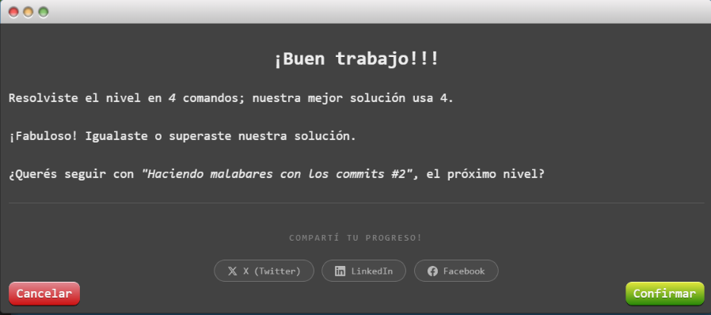
**Aprendizaje:** Aprendí que `git commit --amend` permite modificar el commit más reciente. La principal dificultad fue entender que primero era necesario reordenar los commits para poder modificar el que se encontraba más atrás en la historia y posteriormente volver a organizarlos.

### M4.3 - Haciendo malabares con los commits #2

**Objetivo:** Modificar un commit anterior utilizando `cherry-pick` y `git commit --amend`, evitando el reordenamiento de commits utilizado en el nivel anterior.

**Estado inicial:** La secuencia de commits es lineal: `C0 → C1 → C2 → C3`.

Cada rama apunta a un commit distinto:

- `main` se encuentra en `C1`.
- `newImage` se encuentra en `C2`.
- `caption` se encuentra en `C3`.
- `HEAD` está acoplado a `caption` y apunta a `C3`.

| Paso | Comando | Efecto sobre el repositorio |
|---:|---|---|
| 1 | `git checkout main` | Cambia la rama activa a `main`, haciendo que `HEAD` apunte a `main` en `C1`. |
| 2 | `git cherry-pick C2` | Copia los cambios introducidos por `C2` y los aplica sobre `main`, creando una nueva versión del commit en `main`. |
| 3 | `git commit --amend` | Modifica el commit que se encuentra actualmente en `HEAD`, generando una nueva versión del commit con los cambios corregidos. |
| 4 | `git cherry-pick C3` | Copia los cambios de `C3` y los aplica sobre la nueva versión de `main`. |

**Estado final:** Desde `C1` se observan diferentes bifurcaciones generadas durante el proceso. La rama `newImage` conserva su commit original, mientras que las operaciones de `cherry-pick` y `amend` generan nuevas versiones de los commits. Finalmente, `main` queda sobre la cadena que contiene la versión modificada de `newImage` seguida por el cambio de `caption`.

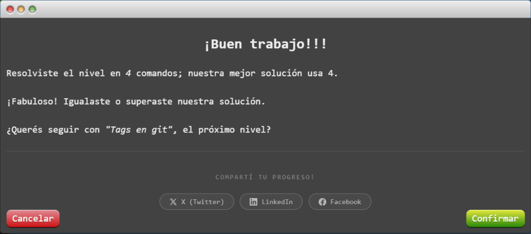
**Aprendizaje:** Aprendí que `cherry-pick` puede ser una alternativa al rebase para trabajar con un commit específico sin tener que reorganizar toda la historia. Una complicación fue distinguir entre el commit original y las nuevas versiones creadas al aplicar sus cambios.

### M4.4 - Tags en Git

**Objetivo:** Crear los tags `v0` y `v1` sobre los commits `C1` y `C2`, respectivamente, y posteriormente hacer checkout del tag `v1`.

**Estado inicial:** Los commits `C1` y `C2` no tienen tags. La rama `main` se encuentra en `C5` y `HEAD` está acoplado a `main`.

| Paso | Comando | Efecto sobre el repositorio |
|---:|---|---|
| 1 | `git tag v0 C1` | Crea el tag `v0` apuntando permanentemente al commit `C1`. |
| 2 | `git tag v1 C2` | Crea el tag `v1` apuntando permanentemente al commit `C2`. |
| 3 | `git checkout C2` | Mueve `HEAD` al commit `C2`. Como no se realiza checkout de una rama, `HEAD` queda desacoplado. |

**Estado final:** El commit `C1` tiene asociado el tag `v0` y el commit `C2` tiene asociado el tag `v1`. `HEAD` se encuentra en `C2` en estado *detached HEAD*.

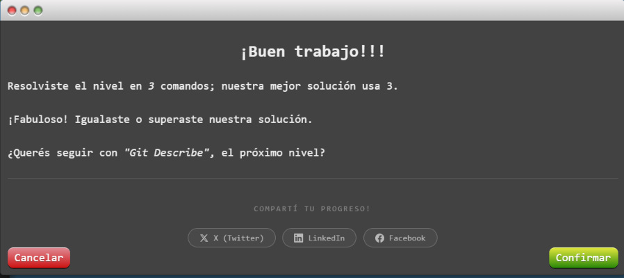

**Aprendizaje:** Aprendí que los tags permiten marcar commits importantes de forma permanente. A diferencia de una rama, un tag no avanza al crear nuevos commits. También comprendí que al hacer checkout de un tag se puede entrar en estado `detached HEAD`.

### M4.5 - Git Describe

**Objetivo:** Utilizar `git describe` para describir la posición de la rama `main` con respecto al tag más cercano en su historial.

**Estado inicial:** El repositorio contiene varios tags distribuidos en diferentes ramas. La posición exacta de `HEAD` depende de la rama activa.

| Paso | Comando | Efecto sobre el repositorio |
|---:|---|---|
| 1 | `git describe main` | Describe el commit al que apunta `main` utilizando como referencia el tag más cercano en su historial. |

**Estado final:** Se obtiene la descripción de la rama `main` mediante el formato proporcionado por `git describe`, indicando el tag de referencia, la cantidad de commits posteriores y el hash abreviado del commit descrito.

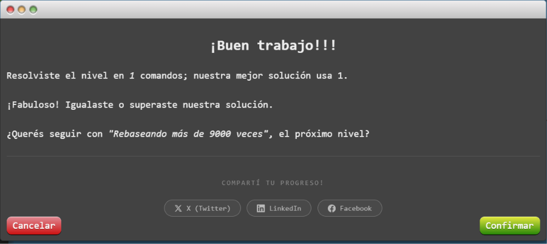

**Aprendizaje:** Aprendí a utilizar `git describe` para identificar la posición de una referencia respecto al tag más cercano. Esto permite obtener información útil sobre cuántos commits separan una rama o commit de un punto de referencia.

### M5.1 - Rebaseando múltiples ramas

**Objetivo:** Rebasear todas las ramas de trabajo sobre `main` para obtener un historial lineal en el que los commits queden ordenados secuencialmente, desde `C0` hasta `C7`.

**Estado inicial:** La historia comienza en `C0 → C1`.

Desde `C1` se bifurca la rama `main`, que avanza hasta `C2`. La rama `bugFix` se encuentra en `C3`.

Desde `C0` se origina otra rama que avanza hasta `C4` y `C5`. Desde `C5` se bifurcan las ramas `side`, que llega hasta `C6`, y `another`, que llega hasta `C7`.

La rama `main` es la rama activa inicialmente y `HEAD` apunta a `C2`.

| Paso | Comando | Efecto sobre el repositorio |
|---:|---|---|
| 1 | `git rebase main bugFix` | Rebasea la rama `bugFix` sobre `main`, colocando sus commits posteriores a `main`. |
| 2 | `git rebase bugFix side` | Rebasea la rama `side` sobre `bugFix`, colocando sus commits posteriores a la nueva posición de `bugFix`. |
| 3 | `git rebase side another` | Rebasea la rama `another` sobre `side`, continuando con la reorganización lineal del historial. |
| 4 | `git rebase another main` | Rebasea la rama `main` sobre `another`, dejando todo el trabajo organizado en una única secuencia de commits. |

**Estado final:** Los commits quedan organizados de forma lineal y secuencial desde `C0` hasta `C7`, cumpliendo el objetivo de que `C7` sea el último commit, seguido anteriormente por `C6`, `C5` y así sucesivamente.

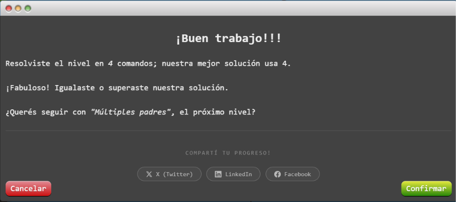

**Aprendizaje:** Aprendí que `git rebase` puede utilizarse para reorganizar varias ramas y construir un historial lineal. La principal dificultad fue identificar en qué orden debía realizar los rebases para que todas las ramas terminaran en la secuencia solicitada.

### M5.2 - Especificando los padres

**Objetivo:** Crear una nueva rama llamada `bugWork` en el commit `C2`, utilizando referencias relativas y especificando los padres de los commits en lugar de indicar directamente el hash del commit.

**Estado inicial:** `HEAD` se encuentra en el commit `C7`. Se requiere crear la rama `bugWork` apuntando al commit `C2`.

| Paso | Comando | Efecto sobre el repositorio |
|---:|---|---|
| 1 | `git branch bugWork main^^2^` | Crea la rama `bugWork` en el commit `C2`. La expresión `^^2^` utiliza referencias relativas: `^^` retrocede por los primeros padres y `^2` selecciona el segundo padre cuando se encuentra un commit de merge. |

**Estado final:** Se crea la rama `bugWork` apuntando al commit `C2`, utilizando referencias relativas y selección de padres en lugar de especificar directamente el hash `C2`.

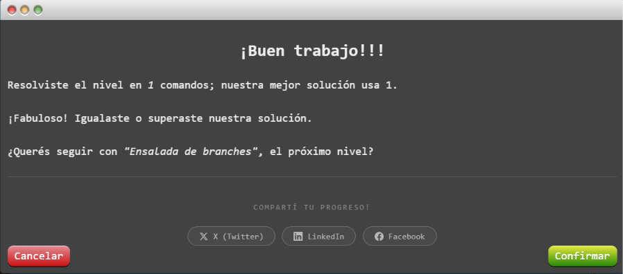

**Aprendizaje:** Aprendí que los modificadores `^` permiten recorrer los padres de un commit y seleccionar un padre específico en los commits de merge. Al principio fue confuso interpretar una expresión como `main^^2^`, pero permitió llegar al commit requerido sin utilizar directamente su hash.

### M5.3 - Ensalada de Branches

**Objetivo:** Actualizar las ramas `one`, `two` y `three` a partir de los commits de `main`, aplicando los cambios requeridos para cada rama.

- La rama `one` necesita reordenar los commits y eliminar `C5`.
- La rama `two` necesita únicamente reordenar los commits.
- La rama `three` necesita solamente avanzar hasta el commit correspondiente.

**Estado inicial:** La secuencia de commits es lineal: `C0 → C1 → C2 → C3 → C4`. Las ramas `one`, `two` y `three` se encuentran en `C1`, mientras que `main` se encuentra en `C5`.

| Paso | Comando | Efecto sobre el repositorio |
|---:|---|---|
| 1 | `git checkout one` | Cambia a la rama `one`. |
| 2 | `git cherry-pick C4 C3 C2` | Copia los cambios de `C4`, `C3` y `C2` sobre `one`, en ese orden, creando nuevas versiones de esos commits. |
| 3 | `git checkout two` | Cambia a la rama `two`. |
| 4 | `git cherry-pick C5 C4 C3 C2` | Copia los cambios de `C5`, `C4`, `C3` y `C2` sobre `two`, generando una nueva secuencia de commits. |
| 5 | `git branch -f three C2` | Fuerza el movimiento de la rama `three` para que apunte directamente al commit `C2`. |

**Estado final:** La rama `three` queda en `C2`.

La rama `one` contiene una nueva secuencia de commits basada en `C1`, con los cambios de `C4`, `C3` y `C2` reorganizados mediante `cherry-pick`.

La rama `two` contiene una nueva secuencia basada en `C1`, con los cambios de `C5`, `C4`, `C3` y `C2` aplicados mediante `cherry-pick`.

La rama `main` conserva su posición en la secuencia original.

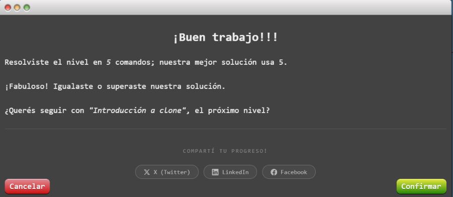

**Aprendizaje:** Aprendí que existen diferentes formas de reorganizar ramas dependiendo de lo que se necesite conservar. En este nivel utilicé `cherry-pick` para copiar commits específicos y `git branch -f` para mover directamente una rama, lo que me permitió obtener las estructuras solicitadas para cada rama.

### R1.1 - Introducción a clone

**Objetivo:** Clonar un repositorio existente utilizando `git clone`, creando una copia local del repositorio remoto.

**Estado inicial:** Se tiene un repositorio remoto con dos commits: `C0` y `C1`.

| Paso | Comando | Efecto sobre el repositorio |
|---:|---|---|
| 1 | `git clone` | Se crea una copia local del repositorio existente, incluyendo su historial de commits y referencias remotas. |

**Estado final:** Se obtiene una copia local del repositorio remoto con los commits `C0` y `C1`, lista para continuar trabajando de manera local.

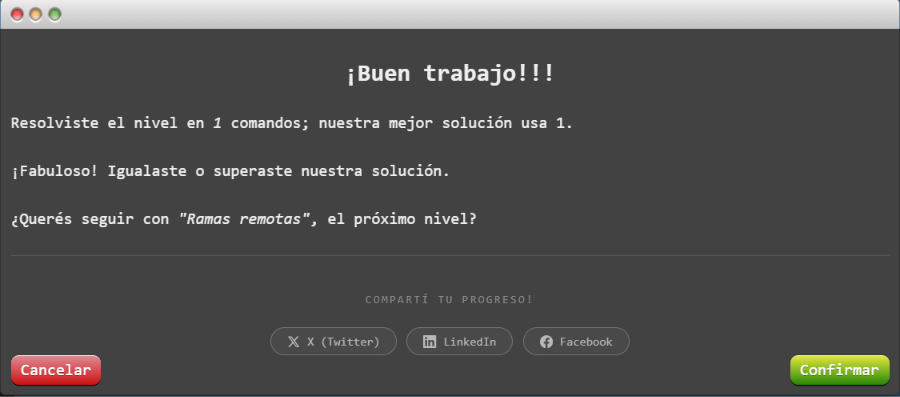

**Aprendizaje:** Aprendí que `git clone` permite crear rápidamente una copia local de un repositorio remoto junto con su historial. También entendí que clonar un repositorio no consiste únicamente en copiar los archivos, sino en crear una estructura de Git vinculada al repositorio remoto.

### R1.2 - Ramas remotas de Git

**Objetivo:** Comprender el funcionamiento de las ramas remotas mediante la creación de commits tanto en la rama local como después de hacer checkout de `o/main`.

**Estado inicial:** Se tienen dos repositorios. El repositorio remoto contiene los commits `C0` y `C1`, con `main` y `o/main` apuntando a `C1`. El repositorio local clonado contiene inicialmente los mismos commits y la rama `main` apunta a `C1`.

| Paso | Comando | Efecto sobre el repositorio |
|---:|---|---|
| 1 | `git commit` | Se crea un nuevo commit local a partir de `C1`, por lo que `main` avanza al nuevo commit. |
| 2 | `git checkout o/main` | `HEAD` se mueve a la rama remota `o/main`, quedando desacoplado de una rama local. |
| 3 | `git commit` | Se crea un nuevo commit mientras `HEAD` está desacoplado, sin mover la referencia `o/main`. |

**Estado final:** `o/main` permanece en `C1`, mientras que la rama `main` avanza con su nuevo commit y se crea otro commit con `HEAD` desacoplado.

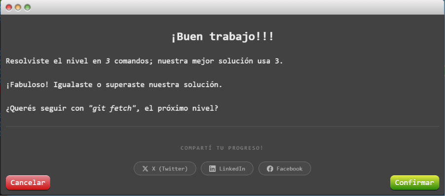

**Aprendizaje o dificultad encontrada:** Aprendí que las ramas remotas funcionan como referencias al estado que Git conoce del repositorio remoto y no como ramas normales sobre las que se trabaja directamente. La principal dificultad fue entender por qué hacer checkout de `o/main` deja a `HEAD` desacoplado.

### R1.3 - Git Fetch

**Objetivo:** Utilizar `git fetch` para descargar los nuevos commits y referencias del repositorio remoto sin modificar directamente la rama de trabajo local.

**Estado inicial:** Los repositorios no están sincronizados y existen commits en el repositorio remoto que todavía no están disponibles localmente.

| Paso | Comando | Efecto sobre el repositorio |
|---:|---|---|
| 1 | `git fetch` | Descarga los nuevos commits y actualiza las referencias de las ramas remotas, sin realizar un merge sobre la rama local activa. |

**Estado final:** Los commits que estaban disponibles en el repositorio remoto ahora también están disponibles localmente y las referencias remotas quedan actualizadas.

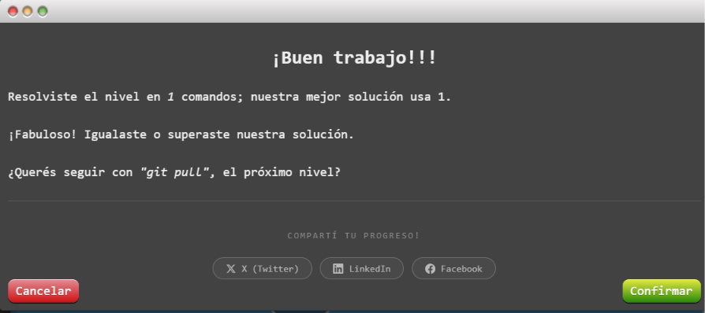

**Aprendizaje:** Aprendí que `git fetch` permite obtener los cambios del repositorio remoto sin modificar inmediatamente la rama local. Esto permite revisar los cambios antes de decidir cómo integrarlos.

### R1.4 - Git Pull

**Objetivo:** Utilizar `git pull` para actualizar la rama local con los cambios disponibles en el repositorio remoto.

**Estado inicial:** El repositorio local tiene `o/main` en `C1` y `main` en `C2`. El repositorio remoto contiene cambios que todavía no están integrados en la rama local.

| Paso | Comando | Efecto sobre el repositorio |
|---:|---|---|
| 1 | `git pull` | Descarga los cambios del repositorio remoto y los integra automáticamente en la rama local mediante `fetch` y `merge`. |

**Estado final:** El repositorio local queda actualizado e integrado con los cambios provenientes del repositorio remoto.

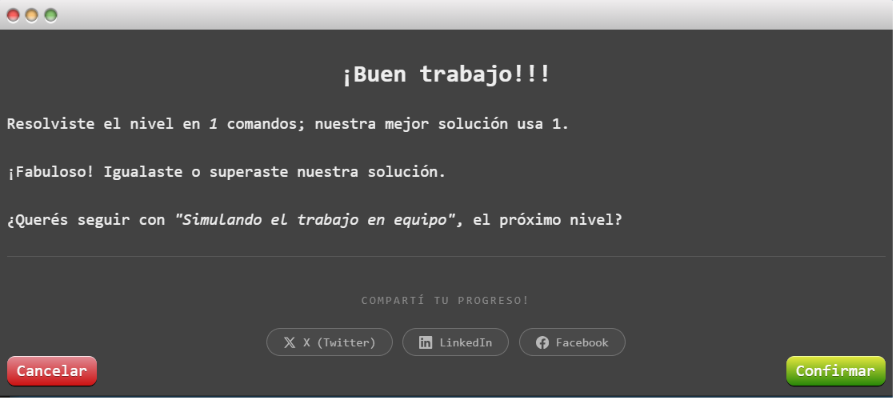

**Aprendizaje o dificultad encontrada:** Aprendí que `git pull` combina las operaciones `fetch` y `merge`. Al principio puede resultar confuso porque parece ser un único comando, pero en realidad realiza ambas acciones para actualizar e integrar los cambios remotos.

### R1.5 - Simulando el trabajo en equipo

**Objetivo:** Simular un flujo de trabajo colaborativo utilizando `git clone`, `git fakeTeamwork`, `git commit` y `git pull`, representando cambios realizados tanto por un compañero como por el usuario.

**Estado inicial:** Se tiene un repositorio local con los commits `C0` y `C1`, con la rama `main` apuntando a `C1`.

| Paso | Comando | Efecto sobre el repositorio |
|---:|---|---|
| 1 | `git clone` | Se crea una copia local del repositorio. |
| 2 | `git fakeTeamwork 2` | Se simulan dos commits realizados por un compañero en el repositorio remoto. |
| 3 | `git commit` | Se crea un nuevo commit de trabajo propio en el repositorio local. |
| 4 | `git pull` | Se descargan e integran los cambios realizados en el repositorio remoto. |

**Estado final:** Se clona el repositorio, se simulan dos commits realizados por un compañero, se realiza un commit propio en el repositorio original y finalmente se utiliza `git pull` para integrar los cambios remotos.

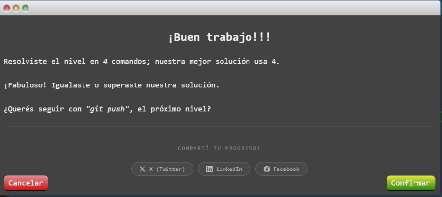

**Aprendizaje o dificultad encontrada:** Aprendí cómo se puede representar un flujo básico de trabajo en equipo con Git. Una dificultad fue comprender que los cambios locales y remotos pueden avanzar de forma independiente y que posteriormente es necesario sincronizarlos.

### R1.6 - Git Push

**Objetivo:** Crear dos nuevos commits en el repositorio local y compartirlos con el repositorio remoto mediante `git push`.

**Estado inicial:** Los dos repositorios se encuentran sincronizados y contienen el mismo historial de commits.

| Paso | Comando | Efecto sobre el repositorio |
|---:|---|---|
| 1 | `git commit` | Se crea un nuevo commit en la rama local. |
| 2 | `git commit` | Se crea un segundo commit sobre el anterior. |
| 3 | `git push` | Los nuevos commits locales se envían al repositorio remoto y la rama remota se actualiza. |

**Estado final:** Los dos nuevos commits están presentes tanto en el repositorio local como en el repositorio remoto, quedando ambos repositorios sincronizados nuevamente.

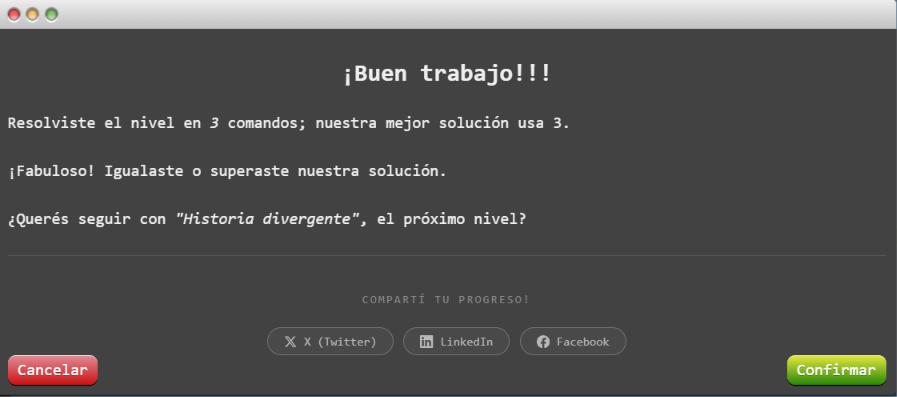

**Aprendizaje:** Aprendí que `git push` permite publicar en el repositorio remoto los commits que ya existen localmente. También comprendí que realizar un commit no significa que los cambios sean compartidos automáticamente con los demás integrantes del proyecto.

### R1.7 - Trabajo divergente

**Objetivo:** Integrar los cambios realizados por un compañero en el repositorio remoto con el trabajo local mediante un rebase y posteriormente publicar los cambios utilizando `git push`.

**Estado inicial:** Se tiene un repositorio remoto con un solo commit. Se clona el repositorio y posteriormente el repositorio remoto recibe un commit realizado por un compañero. Al mismo tiempo, se realiza un commit de trabajo propio en el repositorio local.

| Paso | Comando | Efecto sobre el repositorio |
|---:|---|---|
| 1 | `git clone` | Se crea una copia local del repositorio remoto y `main` queda configurada para seguir a `o/main`. |
| 2 | `git fakeTeamwork` | Se simula un commit realizado por un compañero en el repositorio remoto. |
| 3 | `git commit` | Se crea un commit propio en la rama local, haciendo que la historia local y remota diverjan. |
| 4 | `git pull --rebase` | Se descargan los cambios remotos y se reaplica el commit local sobre la versión más reciente del repositorio remoto. |
| 5 | `git push` | Se publican en el repositorio remoto los cambios locales después de haberlos actualizado mediante rebase. |

**Estado final:** El trabajo propio queda basado sobre el commit realizado por el compañero y posteriormente se publica mediante `git push`, dejando nuevamente sincronizadas las historias local y remota.

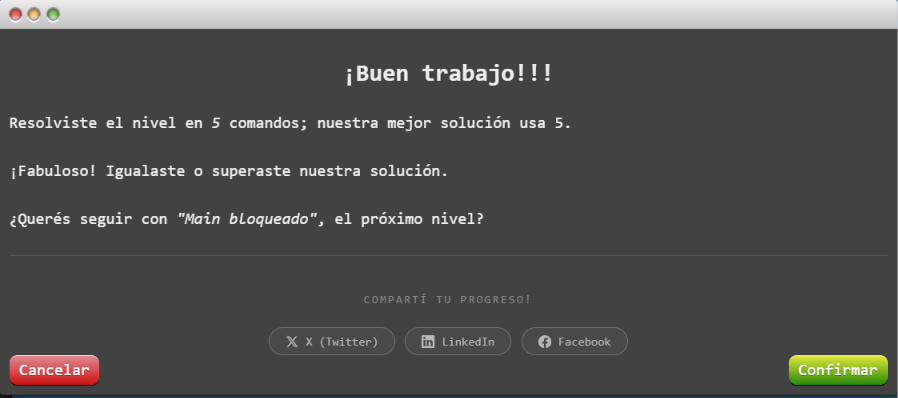

**Aprendizaje o dificultad encontrada:** Aprendí a resolver una divergencia entre el historial local y remoto utilizando `git pull --rebase`. La principal dificultad fue entender por qué `git push` no podía ejecutarse directamente cuando ambas historias habían avanzado de manera independiente.

### R1.8 - Remote Rejected!

**Objetivo:** Crear una nueva rama llamada `feature`, publicarla en el repositorio remoto y devolver la rama `main` a la posición de `o/main` para mantenerla sincronizada.

**Estado inicial:** El repositorio local contiene los commits `C0`, `C1` y `C2`. La rama remota `o/main` se encuentra en `C1`, mientras que `main` se encuentra en `C2`. El otro repositorio contiene los commits `C0` y `C1`, con `main` en `C1`.

| Paso | Comando | Efecto sobre el repositorio |
|---:|---|---|
| 1 | `git branch -f main o/main` | Fuerza el movimiento de la rama local `main` para que vuelva a apuntar al mismo commit que `o/main`, quedando sincronizada con el repositorio remoto. |
| 2 | `git checkout -b feature C2` | Crea una nueva rama llamada `feature` a partir del commit `C2` y cambia a ella. |
| 3 | `git push origin feature` | Publica la rama `feature` y sus commits en el repositorio remoto. |

**Estado final:** La rama `main` vuelve a estar sincronizada con `o/main`, mientras que la nueva rama `feature` contiene el trabajo basado en `C2` y ha sido publicada correctamente en el repositorio remoto.

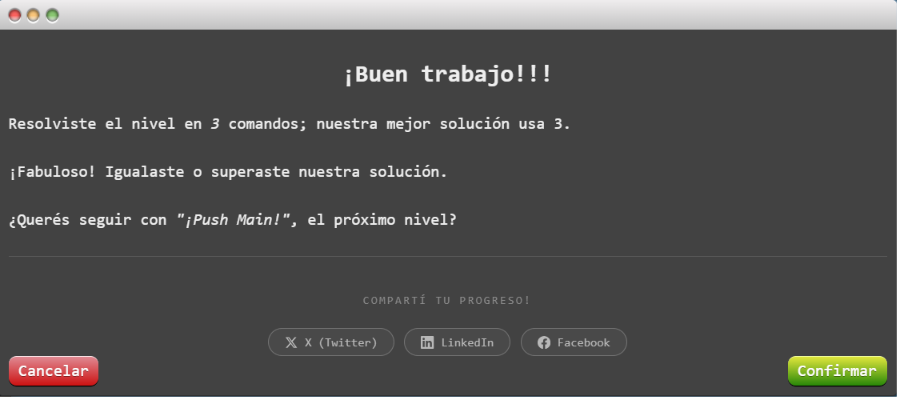

**Aprendizaje o dificultad encontrada:** Aprendí que una rama local puede moverse independientemente de la rama remota y que es importante mantener `main` sincronizada antes de continuar trabajando. También reforcé el uso de `git branch -f` para mover una referencia y de `git push` para publicar una rama nueva.

### R2.1 - Push main

**Objetivo:** Integrar los cambios del repositorio remoto con el trabajo de las ramas `side1`, `side2` y `side3`, y posteriormente publicar todo el trabajo en el remoto manteniendo un historial lineal.

**Estado inicial:** Se tiene un repositorio local con el commit `C1`, donde se encuentran `main` y `o/main`. Desde `C1` se generan varias ramas: `side1` llega hasta `C2`, `side2` llega hasta `C4` pasando por `C3`, y `side3` llega hasta `C7` pasando por `C5` y `C6`. El repositorio remoto fue actualizado y contiene un nuevo commit `C8`.

**Comandos:**

| Paso | Comando | Efecto sobre el repositorio |
|---:|---|---|
| 1 | `git fetch` | Descarga los cambios del repositorio remoto y actualiza la referencia `o/main` para incluir `C8`. |
| 2 | `git rebase o/main side1` | Rebasea `side1` sobre la versión actualizada de `o/main`, reaplicando sus cambios después de `C8`. |
| 3 | `git rebase side1 side2` | Rebasea `side2` sobre `side1`, incorporando su trabajo después de los cambios de `side1`. |
| 4 | `git rebase side2 side3` | Rebasea `side3` sobre `side2`, continuando con la organización lineal de los commits. |
| 5 | `git rebase side3 main` | Rebasea `main` sobre `side3`, dejando todo el trabajo en una única secuencia. |
| 6 | `git push` | Publica en el repositorio remoto los commits resultantes del rebase. |

**Estado final:** Los dos repositorios quedan sincronizados y presentan una historia lineal con el orden `C0 → C1 → C8 → C2' → C3' → C4' → C5' → C6' → C7'`.

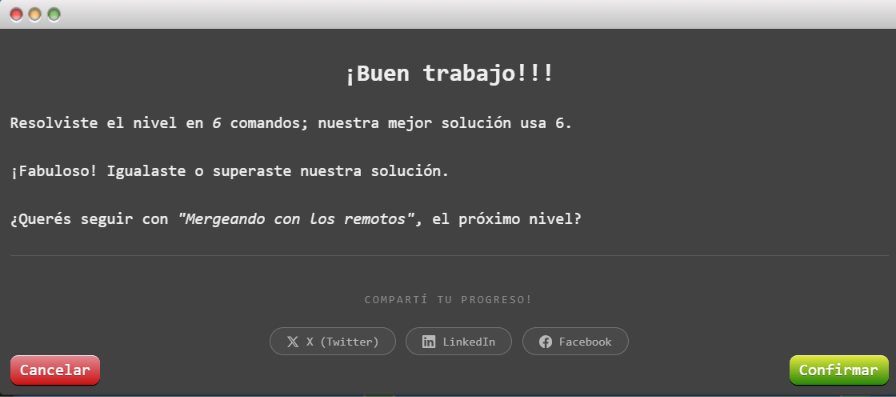

**Aprendizaje:** Aprendí a utilizar `git rebase` de forma consecutiva para integrar varias ramas sobre una rama base y mantener un historial lineal. La principal dificultad fue organizar correctamente el orden de los rebases, ya que cada rama debía utilizar como base la rama actualizada anteriormente.

### R2.2 - Mergeando con los remotos

**Objetivo:** Resolver una situación similar a la del nivel anterior utilizando `git merge` en lugar de `git rebase`, integrando los cambios remotos y los trabajos de las ramas `side1`, `side2` y `side3`.

**Estado inicial:** Se tiene un repositorio local con `C1`, donde se encuentran `main` y `o/main`. Desde `C1` se bifurcan las ramas `side1`, `side2` y `side3`, con sus respectivos commits hasta `C2`, `C4` y `C7`. El repositorio remoto contiene además el commit `C8`.

**Comandos:**

| Paso | Comando | Efecto sobre el repositorio |
|---:|---|---|
| 1 | `git checkout main` | Cambia a la rama local `main`. |
| 2 | `git pull` | Descarga los cambios del remoto y los integra en `main`. |
| 3 | `git merge side1` | Integra en `main` los cambios realizados en `side1`. |
| 4 | `git merge side2` | Integra los cambios de `side2` en la rama `main`. |
| 5 | `git merge side3` | Integra los cambios de `side3` en `main`. |
| 6 | `git push` | Publica en el repositorio remoto el historial resultante. |

**Estado final:** Los repositorios quedan sincronizados después de integrar mediante `merge` los cambios de las diferentes ramas y los cambios provenientes del remoto.

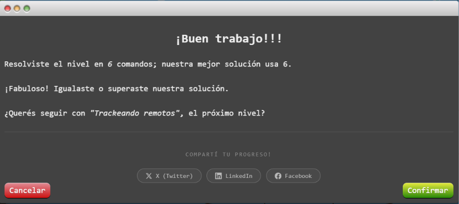

**Dificultad encontrada:** La principal dificultad fue diferenciar este procedimiento del realizado con `rebase`. Con `merge`, las ramas se integran preservando la estructura de bifurcaciones, mientras que `rebase` reorganiza los commits para formar una historia más lineal.

### R2.3 - Trackeando remotos

**Objetivo:** Comprender el funcionamiento de las ramas que realizan seguimiento de ramas remotas y utilizar esta relación para publicar cambios en la rama `main` del repositorio remoto sin trabajar directamente sobre `main` local.

**Estado inicial:** Un repositorio contiene `C0` y `C1`, con `main` y `o/main` en `C1`. El otro repositorio contiene `C0`, `C1` y `C2`, con `main` en `C2`.

**Comandos:**

| Paso | Comando | Efecto sobre el repositorio |
|---:|---|---|
| 1 | `git checkout -b side o/main` | Crea la rama local `side` a partir de `o/main` y establece que `side` realice seguimiento de esa rama remota. |
| 2 | `git commit` | Crea un nuevo commit de trabajo sobre la rama `side`. |
| 3 | `git pull --rebase` | Descarga los cambios remotos y reaplica el trabajo local sobre la versión más reciente del remoto. |
| 4 | `git push` | Publica los cambios de `side` en la rama remota que está configurada como su destino de seguimiento. |

**Estado final:** Los repositorios contienen la secuencia actualizada `C0 → C1 → C2 → C3'`. El commit original `C3` queda como una versión anterior debido al rebase, mientras que el nuevo commit `C3'` queda integrado en el historial actualizado.

**Aprendizaje:** Aprendí que una rama local puede estar configurada para seguir una rama remota específica. Esto permite que comandos como `git pull` y `git push` conozcan automáticamente cuál es la rama remota que deben utilizar.

### R2.4 - Parámetros de git push

**Objetivo:** Actualizar las ramas `main` y `foo` del repositorio remoto utilizando explícitamente el remoto y la rama de destino mediante los parámetros de `git push`.

**Estado inicial:** Se tienen dos repositorios. El repositorio local contiene `C0` y `C1`, con `o/foo` y `o/main` en `C1`. Desde `C1` se bifurcan `main`, que avanza hasta `C2`, y `foo`, que avanza hasta `C3`. El `HEAD` se encuentra inicialmente en `C0`. El otro repositorio contiene `C0` y `C1`.

**Comandos:**

| Paso | Comando | Efecto sobre el repositorio |
|---:|---|---|
| 1 | `git push origin main` | Envía la rama local `main` al remoto `origin`, actualizando la rama remota `main`. |
| 2 | `git push origin foo` | Envía la rama local `foo` al remoto `origin`, actualizando la rama remota `foo`. |

**Estado final:** Los dos repositorios quedan con la misma estructura. Después de `C1`, existen dos bifurcaciones: una contiene `C2` con `main` y `o/main`, y la otra contiene `C3` con `foo` y `o/foo`.

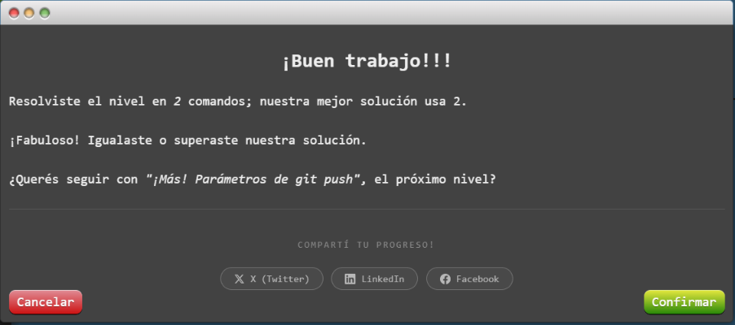

**Aprendizaje:** Aprendí que `git push origin main` permite especificar explícitamente tanto el repositorio remoto como la rama que se desea actualizar. Esto es especialmente útil cuando no estamos ubicados en la rama que queremos publicar y no queremos depender de la configuración de seguimiento de la rama actual.

### R2.5 - Más parámetros de git push
**Objetivo:** Utilizar la sintaxis `<origen>:<destino>` de `git push` para especificar de manera independiente la rama o referencia local de la que se obtienen los commits y la rama remota a la que se envían.

**Estado inicial:** Se tienen dos repositorios. El repositorio local contiene los commits `C0` y `C1`, mientras que el repositorio remoto contiene una estructura con commits adicionales. El objetivo es utilizar una referencia con dos puntos para enviar commits desde una referencia local hacia una rama remota diferente.

**Comandos:**
| Paso | Comando | Efecto sobre el repositorio |
|---:|---|---|
| 1 | `git push origin main^:foo` | Envía el commit anterior al commit apuntado por `main` hacia la rama remota `foo`. |
| 2 | `git push origin foo:main` | Envía la referencia de la rama local `foo` hacia la rama remota `main`. |

**Estado final:** Los dos repositorios quedan con la misma estructura, con las ramas remotas actualizadas de acuerdo con las referencias especificadas en los comandos `git push`.

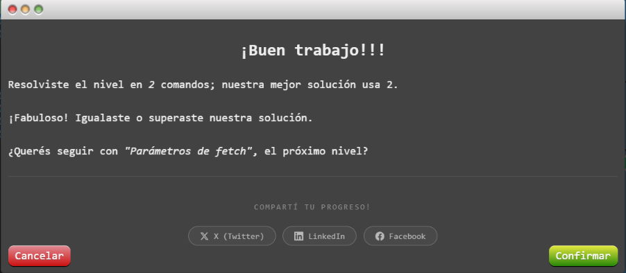

**Aprendizaje:** Aprendí que `git push` permite especificar de manera independiente el origen y el destino mediante la sintaxis `<origen>:<destino>`. Esto permite enviar los commits de una rama o referencia local hacia una rama remota con un nombre diferente. También aprendí que una referencia como `main^` puede utilizarse como origen, permitiendo seleccionar un commit específico en lugar de una rama completa.

### R2.6 - Parámetros de git fetch
**Objetivo:** Utilizar la sintaxis `<origen>:<destino>` con `git fetch` para descargar commits desde una referencia del repositorio remoto y colocarlos directamente en una rama local específica.

**Estado inicial:** Se tienen dos repositorios. El repositorio local contiene únicamente los commits `C0` y `C1`, con `C1` como `HEAD`, y las ramas `main` y `foo` junto con sus respectivas referencias remotas. El repositorio remoto contiene dos bifurcaciones a partir de `C1`: una contiene los commits `C2`, `C3` y `C4`, con `main` apuntando a `C4`; la otra contiene los commits `C5` y `C6`, con `foo` apuntando a `C6`.

**Comandos:**
| Paso | Comando | Efecto sobre el repositorio |
|---:|---|---|
| 1 | `git fetch origin c3:foo` | Descarga desde el remoto el commit `C3` y actualiza la rama local `foo` para que apunte a ese commit. |
| 2 | `git fetch origin c6:main` | Descarga desde el remoto el commit `C6` y actualiza la rama local `main` para que apunte a ese commit. |
| 3 | `git checkout foo` | Cambia la rama actualmente seleccionada a `foo`. |
| 4 | `git merge main` | Fusiona los cambios de la rama local `main` dentro de la rama `foo`. |

**Estado final:** La rama `foo` contiene los commits descargados y posteriormente se integran los cambios de `main` mediante el `merge`, alcanzando la estructura mostrada en el objetivo del nivel.

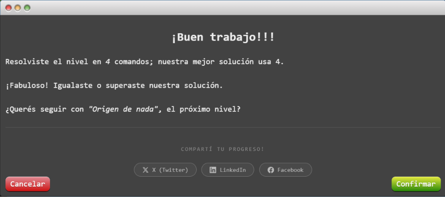

**Aprendizaje:** Aprendí que `git fetch` también permite utilizar una refspec con la forma `<origen>:<destino>`, pero en este caso la dirección es opuesta a `git push`: el origen corresponde a una referencia remota y el destino a una referencia local. Esto permite descargar commits directamente hacia una rama local específica. También aprendí que no se puede hacer `fetch` directamente sobre la rama que se encuentra actualmente seleccionada.

### R2.7 - Origen de nada
**Objetivo:** Eliminar una rama remota y crear una nueva rama remota utilizando `git push` y `git fetch` con una referencia vacía como origen o destino.

**Estado inicial:** Se tienen dos repositorios con la misma estructura. El repositorio local contiene las referencias remotas `o/main` y `o/foo`, mientras que el repositorio remoto contiene las ramas correspondientes.

**Comandos:**
| Paso | Comando | Efecto sobre el repositorio |
|---:|---|---|
| 1 | `git push origin :foo` | Elimina la rama `foo` del repositorio remoto al utilizar un origen vacío. |
| 2 | `git fetch origin :bar` | Crea o actualiza la referencia local `bar` utilizando una referencia vacía como origen. |

**Estado final:** El repositorio remoto deja de tener la rama `foo` y se crea la nueva referencia `bar`, alcanzando la estructura solicitada por el nivel.

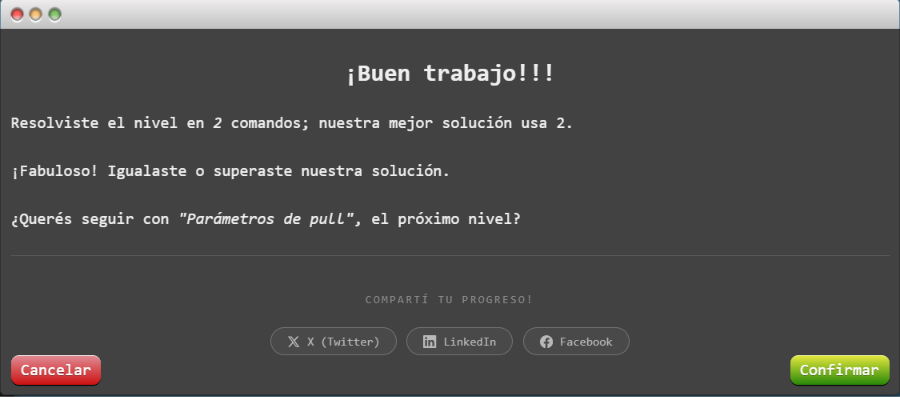

**Aprendizaje:** Aprendí que una referencia con el origen vacío puede utilizarse para eliminar una rama remota mediante `git push origin :foo`. También comprendí que la sintaxis de refspec permite realizar operaciones sobre ramas sin necesidad de especificar un commit de origen.

### R2.8 - Parámetros de git pull
**Objetivo:** Utilizar los parámetros de `git pull` para descargar commits desde el repositorio remoto y crear o actualizar ramas locales, comprendiendo que `git pull` combina las operaciones de `git fetch` y `git merge`.

**Estado inicial:** Se tienen dos repositorios. El repositorio local contiene los commits `C0` y `C1`, con las referencias `o/main` y `o/bar`, y la rama `main` apunta al commit `C2`. El repositorio remoto contiene una bifurcación a partir de `C1`: una rama contiene `C2` y tiene `main` apuntando a este commit, mientras que la otra contiene `C3` y tiene `bar` apuntando a este commit.

**Comandos:**
| Paso | Comando | Efecto sobre el repositorio |
|---:|---|---|
| 1 | `git pull origin c3:foo` | Descarga el commit `C3` desde el remoto y lo integra en la referencia local `foo` mediante el comportamiento de `git pull`. |
| 2 | `git pull origin c2:side` | Descarga el commit `C2` desde el remoto y crea o actualiza la rama local `side`, integrando los cambios correspondientes. |

**Estado final:** El repositorio local alcanza la estructura indicada en el objetivo, con los commits descargados y las nuevas ramas creadas e integradas mediante las operaciones realizadas con `git pull`.

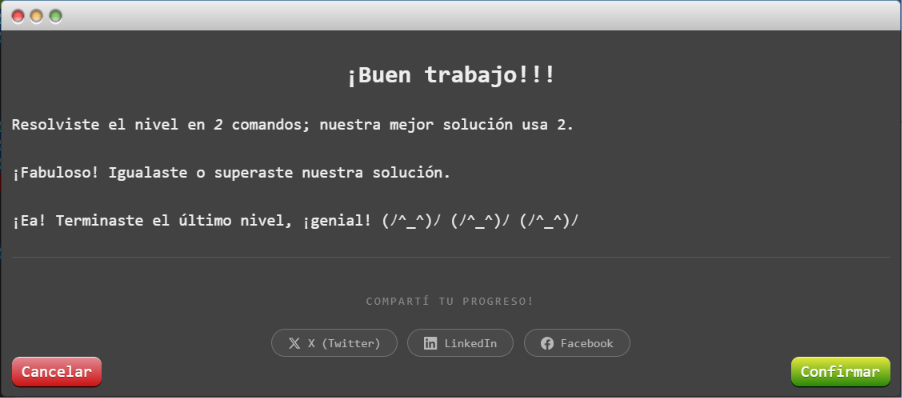

**Aprendizaje:** Aprendí que `git pull` es esencialmente una combinación de `git fetch` y `git merge`. Además, mediante la sintaxis `<origen>:<destino>` es posible indicar explícitamente de dónde descargar los commits y en qué referencia local colocarlos. Esto permite crear nuevas ramas locales y posteriormente integrar los cambios obtenidos del repositorio remoto.

--------
## Captura del mapa completo de progreso de `Main`.

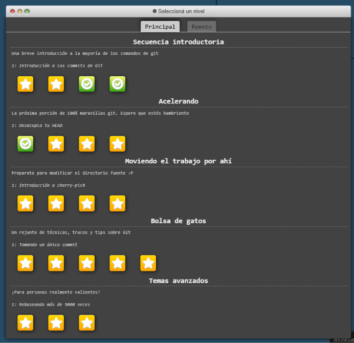

## Captura del mapa completo de progreso de `Remote`.

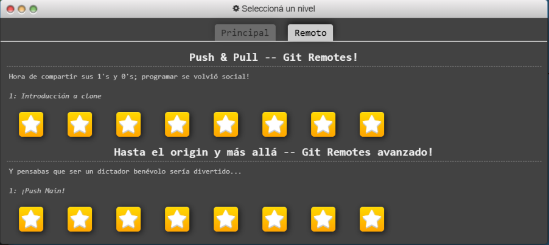

## Tabla resumen que marque los 34 niveles como completados.

#### Niveles de `Main`

| ID | Secuencia | Nivel | Estado |
|---|---|---|---|
| M1.1 | Introduction Sequence | Introduction to Git Commits | Completado |
| M1.2 | Introduction Sequence | Branching in Git | Completado |
| M1.3 | Introduction Sequence | Merging in Git | Completado |
| M1.4 | Introduction Sequence | Rebase Introduction | Completado |
| M2.1 | Ramping Up | Detach yo' HEAD | Completado |
| M2.2 | Ramping Up | Relative Refs (`^`) | Completado |
| M2.3 | Ramping Up | Relative Refs #2 (`~`) | Completado |
| M2.4 | Ramping Up | Reversing Changes in Git | Completado |
| M3.1 | Moving Work Around | Cherry-pick Intro | Completado |
| M3.2 | Moving Work Around | Interactive Rebase Intro | Completado |
| M4.1 | A Mixed Bag | Grabbing Just 1 Commit | Completado |
| M4.2 | A Mixed Bag | Juggling Commits | Completado |
| M4.3 | A Mixed Bag | Juggling Commits #2 | Completado |
| M4.4 | A Mixed Bag | Git Tags | Completado |
| M4.5 | A Mixed Bag | Git Describe | Completado |
| M5.1 | Advanced Topics | Rebasing over 9000 times | Completado |
| M5.2 | Advanced Topics | Multiple parents | Completado |
| M5.3 | Advanced Topics | Branch Spaghetti | Completado |

#### Niveles de `Remote`

| ID | Secuencia | Nivel | Estado |
|---|---|---|---|
| R1.1 | Push & Pull - Git Remotes | Clone Intro | Completado |
| R1.2 | Push & Pull - Git Remotes | Remote Branches | Completado |
| R1.3 | Push & Pull - Git Remotes | Git Fetchin' | Completado |
| R1.4 | Push & Pull - Git Remotes | Git Pullin' | Completado |
| R1.5 | Push & Pull - Git Remotes | Faking Teamwork | Completado |
| R1.6 | Push & Pull - Git Remotes | Git Pushin' | Completado |
| R1.7 | Push & Pull - Git Remotes | Diverged History | Completado |
| R1.8 | Push & Pull - Git Remotes | Locked Main | Completado |
| R2.1 | To Origin And Beyond - Advanced Git Remotes | Push Main! | Completado |
| R2.2 | To Origin And Beyond - Advanced Git Remotes | Merging with remotes | Completado |
| R2.3 | To Origin And Beyond - Advanced Git Remotes | Remote Tracking | Completado |
| R2.4 | To Origin And Beyond - Advanced Git Remotes | Git push arguments | Completado |
| R2.5 | To Origin And Beyond - Advanced Git Remotes | Git push arguments - Expanded! | Completado |
| R2.6 | To Origin And Beyond - Advanced Git Remotes | Fetch arguments | Completado |
| R2.7 | To Origin And Beyond - Advanced Git Remotes | Source of nothing | Completado |
| R2.8 | To Origin And Beyond - Advanced Git Remotes | Pull arguments | Completado |

**Total de niveles completados: 34/34**

## Síntesis sobre los conceptos aprendidos.

Durante el desarrollo de los 34 niveles se aprendieron y practicaron los principales conceptos relacionados con el control de versiones utilizando Git. Inicialmente se trabajó con los conceptos fundamentales de los repositorios, commits, ramas y el HEAD, comprendiendo cómo se construye el historial de un proyecto y cómo se pueden crear diferentes líneas de desarrollo mediante branching.

Uno de los conceptos principales aprendidos fue la manipulación del historial mediante diferentes operaciones. Se practicaron comandos como `git merge`, `git rebase`, `git cherry-pick` y `git revert`, comprendiendo las diferencias entre ellos y los efectos que tienen sobre el historial. También se trabajó con `git rebase -i`, que permite reorganizar, combinar, modificar o eliminar commits de una secuencia de manera interactiva.

También se aprendió a trabajar con referencias y a desplazarse dentro del historial de Git. Las referencias relativas como HEAD^ y HEAD~ permiten seleccionar commits anteriores sin necesidad de conocer directamente sus identificadores. Además, se utilizó git checkout para cambiar la referencia actualmente seleccionada y se aprendió el concepto de HEAD separado o detached HEAD.

Otro aspecto importante fue el manejo de ramas y referencias especiales. Se practicó la creación, modificación y movimiento de ramas, así como el uso de etiquetas mediante git tag y la identificación de commits utilizando git describe. También se analizaron situaciones con múltiples padres y diferentes bifurcaciones del historial, lo que permitió comprender mejor cómo Git representa internamente las diferentes líneas de desarrollo.

En los niveles relacionados con repositorios remotos se aprendió el funcionamiento de `git clone`, `git fetch`, `git pull` y `git push`. Se comprendió la diferencia entre las ramas locales y las ramas remotas, así como el propósito de las referencias de seguimiento remoto como `origin/main`. También se practicó la sincronización de cambios entre repositorios y se analizaron situaciones en las que los historiales locales y remotos divergen.

Un concepto especialmente importante fue el uso de las refspecs. Mediante la sintaxis `<origen>:<destino>` se aprendió que tanto `git push` como `git fetch` permiten especificar de manera explícita de dónde se obtienen los commits y hacia dónde se transfieren. En `git push`, el origen corresponde normalmente a una referencia local y el destino a una referencia remota, mientras que en `git fetch` la dirección se invierte. Esto permitió comprender con mayor profundidad qué ocurre internamente durante la transferencia de commits entre repositorios.

Asimismo, se comprendió que muchas operaciones de Git pueden analizarse como movimientos de referencias dentro de un grafo de commits. Las ramas y referencias no son copias independientes de los commits, sino apuntadores que permiten identificar diferentes posiciones dentro del historial. Esta forma de entender Git facilita la comprensión de operaciones como `merge`, `rebase`, `cherry-pick`, `fetch` y `push`, incluso en situaciones donde existen múltiples ramas, repositorios remotos y historiales divergentes.

## 5.3 Análisis de Git

**1. ¿Cuál es la diferencia entre `merge` y `rebase`? ¿Qué ocurre con el historial en cada caso?**

Ambos comandos integran el trabajo de una rama en otra, pero afectan el historial de forma distinta. `git merge` conserva la estructura real de bifurcaciones, pues cuando dos ramas tienen commits diferentes desde un ancestro común, se crea un commit de merge con dos padres que une ambas líneas de trabajo. Esto se observó en el nivel M1.3, donde al ejecutar `git merge bugFix` sobre `main` se generó un commit de merge porque ambas ramas habían avanzado de forma independiente. En cambio, `git rebase` no crea un commit de merge, sino que toma los commits de una rama y los vuelve a aplicar uno por uno sobre la punta de otra rama, generando nuevas versiones de esos commits. Esto se evidenció en el nivel M1.4, donde `git rebase main` tomó el commit de `bugFix` y lo reubicó encima del nuevo commit de `main`, dejando un historial lineal en lugar de una bifurcación. En resumen: `merge` preserva la historia real (con bifurcaciones y posibles commits de merge), mientras que `rebase` reescribe la historia para volverla lineal, sustituyendo los commits originales por copias con nuevos hashes.

**2. ¿Cuándo conviene utilizar `reset` y cuándo `revert`?**

`git reset` conviene utilizarlo cuando se desea eliminar commits del historial local que todavía no han sido compartidos con nadie, ya que mueve la rama y el `HEAD` hacia atrás, borrando la referencia a los commits posteriores. `git revert` conviene utilizarlo cuando el commit que se desea deshacer ya fue compartido o publicado, porque en lugar de eliminar el historial, crea un nuevo commit que invierte los cambios introducidos, preservando la secuencia original. Esta diferencia se documentó en el nivel M2.4: sobre la rama `local`, que solo existía localmente, se usó `git reset HEAD~1` para eliminar directamente el commit más reciente; en cambio, sobre la rama `pushed`, que ya había sido compartida, se usó `git revert HEAD` para deshacer el cambio sin destruir el historial existente.

**3. ¿Qué significa tener `HEAD` separado o  detached?**

Significa que `HEAD` está apuntando directamente a un commit específico en lugar de apuntar a una rama. Normalmente `HEAD` apunta a una rama (por ejemplo `main`), y esa rama es la que apunta al commit actual; pero al hacer checkout directamente sobre un commit, un hash o un tag, `HEAD` queda desacoplado de cualquier rama. Esto se observó en el nivel M2.1, donde `git checkout C4` dejó a `HEAD` apuntando directamente al commit `C4` sin estar asociado a `bugFix`, y también en el nivel M4.4, donde hacer checkout del tag `v1` produjo el mismo efecto. La consecuencia práctica es que si se realizan nuevos commits en estado *detached HEAD*, ninguna rama avanza junto con ellos, por lo que esos commits pueden quedar huérfanos y ser difíciles de recuperar si no se les asigna una rama antes de moverse a otro lugar.

**4. ¿Qué diferencia existe entre una rama local, una rama remota y una rama de seguimiento remoto?**

Una rama local es una referencia que existe únicamente en el repositorio local y sobre la cual se puede trabajar directamente, creando commits y moviéndola libremente. Una rama remota (con el prefijo `o/`, abreviatura de `origin/` en el simulador) es una referencia que representa el estado que el repositorio local conoce del repositorio remoto la última vez que se sincronizó; no se actualiza automáticamente, sino solo mediante operaciones como `fetch`, `pull` o `push`. Esto se evidenció en el nivel R1.2, donde al hacer commits mientras se tenía checkout sobre `o/main`, la referencia remota no avanzaba y `HEAD` quedaba desacoplado, porque no es una rama normal sobre la que se trabaje directamente. Una rama de seguimiento remoto es una rama local que está configurada para tener una relación directa con una rama remota específica, de modo que comandos como `git pull` y `git push` saben automáticamente hacia dónde enviar o desde dónde traer los cambios sin necesidad de especificarlo. Esto se practicó en el nivel R2.3, donde `git checkout -b side o/main` creó la rama local `side` estableciendo dicha relación de seguimiento con `o/main`.

**5. ¿Qué hacen individualmente `fetch`, `merge`, `pull` y `push`?**

`git fetch` descarga los nuevos commits y actualiza las referencias remotas (como `o/main`) sin modificar ni integrar nada en la rama local activa; esto se practicó en el nivel R1.3. `git merge` integra los cambios de otra rama (local o remota) en la rama actual, generando un commit de merge cuando corresponde; se utilizó, por ejemplo, en R2.2 para incorporar los cambios de `side1`, `side2` y `side3` sobre `main`. `git pull` combina automáticamente las dos operaciones anteriores: primero descarga los cambios remotos mediante `fetch` y luego los integra en la rama local mediante `merge` (o `rebase`, si se usa `git pull --rebase`); esto se documentó en el nivel R1.4. `git push` hace lo opuesto a `fetch`: envía los commits que existen localmente hacia el repositorio remoto y actualiza la rama remota correspondiente, tal como se practicó en el nivel R1.6.

**6. ¿Qué riesgos existen al reescribir un historial que ya fue compartido?**

El principal riesgo es que operaciones como `rebase`, `commit --amend` o `reset` seguido de un nuevo commit generan nuevas versiones de los commits (con hashes distintos), dejando los commits originales como huérfanos en el historial. Si esos commits ya fueron compartidos con otras personas o publicados en un repositorio remoto, quienes hayan basado su propio trabajo sobre la versión original quedarán trabajando sobre commits que ya no existen en la historia principal, lo que puede provocar conflictos, historiales duplicados o la necesidad de forzar un `push` que sobrescriba el trabajo remoto y potencialmente elimine cambios de otras personas. Esto se relaciona directamente con lo observado en niveles como R1.7 y R2.1, donde fue necesario usar `git pull --rebase` precisamente para reaplicar el trabajo propio *encima* de los cambios ya publicados por otra persona, en lugar de reescribir commits que ya estaban compartidos en el remoto.

**7. ¿Para qué resultan útiles `cherry-pick`, las referencias relativas y los tags?**

`git cherry-pick` resulta útil para tomar commits específicos de otra rama y aplicarlos sobre la rama actual sin necesidad de fusionar toda la rama de origen, lo cual permite incorporar solo el trabajo relevante. Esto se practicó en el nivel M3.1, donde se copiaron únicamente los commits `C3`, `C4` y `C7` hacia `main`, y también en M4.3, donde se usó junto con `commit --amend` para modificar un commit anterior sin reordenar todo el historial. Las referencias relativas (`^` y `~`) resultan útiles para desplazarse dentro del historial sin necesidad de conocer el hash exacto de un commit; `^` retrocede un padre a la vez (y permite indicar `^2` para seleccionar el segundo padre en un commit de merge, como se usó en M5.2), mientras que `~` permite retroceder varias generaciones de forma más compacta. Esto se practicó en los niveles M2.2 y M2.3. Los tags resultan útiles para marcar de forma permanente un commit importante (por ejemplo, una versión de release), con la diferencia de que, a diferencia de una rama, un tag no avanza cuando se crean nuevos commits. Esto se practicó en el nivel M4.4, donde se crearon los tags `v0` y `v1` sobre los commits `C1` y `C2`.

**8. ¿Qué diferencias identificó entre el simulador y un repositorio Git real?**

Learn Git Branching introduce varias particularidades pedagógicas que no forman parte de Git real. En primer lugar, el simulador identifica los commits con etiquetas simplificadas como `C0`, `C1`, `C2`, etc., en lugar de los hashes SHA-1 reales que genera Git; esto facilita seguir visualmente el árbol de commits, pero no corresponde a cómo se identifican los commits en un repositorio real. En segundo lugar, el simulador utiliza la abreviatura `o/` para representar las ramas de seguimiento remoto (por ejemplo `o/main`), mientras que en un repositorio Git real esa misma referencia se escribe como `origin/main`. En tercer lugar, el simulador incluye comandos de simulación que no existen en Git, como `git fakeTeamwork`, utilizado en los niveles R1.5 y R1.7 para simular commits realizados por un compañero en el repositorio remoto sin necesidad de un segundo repositorio o colaborador real. Además, el simulador permite crear y manipular repositorios remotos de forma instantánea dentro de la misma interfaz visual, sin necesidad de configurar un servidor, credenciales o una conexión de red real, y muestra siempre una representación gráfica completa del árbol de commits, algo que en un repositorio real solo se puede aproximar mediante comandos como `git log --graph`. Estas simplificaciones son útiles para el aprendizaje conceptual, pero un repositorio Git real exige, además, gestionar autenticación, resolución manual de conflictos de contenido (no solo de estructura de commits), archivos binarios, hooks, configuración de remotos múltiples y coordinación real entre distintas personas trabajando simultáneamente.