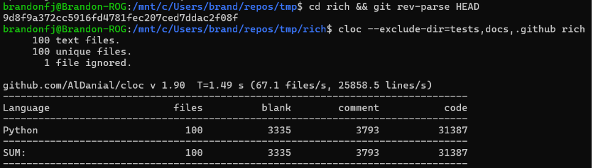

# Selección del proyecto Python - Sphinx

- **Nombre:** Rich
- **Descripción breve:** Librería de Python para generar salida de texto enriquecida y con formato en la terminal, incluyendo tablas, barras de progreso, resaltado de sintaxis, árboles, markdown y `tracebacks` mejorados.
- **URL del repositorio original:** https://github.com/Textualize/rich
- **Licencia:** MIT
- **Lenguaje principal:** Python
- **Commit exacto analizado:** `9d8f9a372cc5916fd4781fec207ced7ddac2f08f` (obtenido con `git rev-parse HEAD`)
- **Cantidad de archivos y líneas de código relevantes:** 100 archivos `.py` relevantes dentro del paquete `rich/`, con 31 387 líneas de código, sin contar los directorios `tests`, `docs` ni archivos de CI.
- **Comando utilizado para obtener las métricas:**

```bash
git clone --depth 1 https://github.com/Textualize/rich.git
cd rich
git rev-parse HEAD
cloc --exclude-dir=tests,docs,.github rich
```

Salida obtenida:

```text
Language                     files          blank        comment           code
-------------------------------------------------------------------------------
Python                         100           3335           3793          31387
-------------------------------------------------------------------------------
SUM:                           100           3335           3793          31387
```


- **Razón por la cual el proyecto es apropiado para Sphinx:** Rich es un paquete Python puro, con módulos bien delimitados por responsabilidad (`table.py`, `console.py`, `segment.py`, `style.py`, `progress.py`, etc.) y una API pública basada en clases y funciones con anotaciones de tipo (*type hints*). Esta estructura es la ideal para `sphinx.ext.autodoc` y `sphinx.ext.napoleon`, que pueden extraer automáticamente la documentación de la API a partir de las firmas y los docstrings existentes.
- **Presencia y calidad inicial de docstrings:** La mayoría de las clases y funciones públicas cuentan con docstrings en formato compatible con Sphinx (descripciones en prosa acompañadas de anotaciones de tipo en la firma, por ejemplo en `rich/table.py` y `rich/console.py`). La cobertura es alta en la API pública, aunque algunos métodos internos o privados (prefijo `_`) tienen documentación mínima o inexistente.
- **Dependencias o dificultades previstas para generar la documentación:**
  - Será necesario crear un entorno virtual e instalar Sphinx junto con extensiones como `sphinx.ext.autodoc`, `sphinx.ext.napoleon` (si se usa estilo Google/NumPy en algunos docstrings) y `sphinx.ext.viewcode`.
  - El proyecto deberá instalarse en modo editable (`pip install -e .`) o agregarse al `sys.path` en `conf.py` para que `autodoc` pueda importar los módulos de `rich/` al momento de generar la documentación.
  - Algunos módulos usan importaciones condicionadas a `TYPE_CHECKING`, lo que puede requerir configuración adicional en `autodoc_type_aliases` o mocks de importación si alguna dependencia opcional no está instalada en el entorno de construcción.
  - Se excluirán los directorios `tests` y `docs` del análisis de tamaño, ya que no forman parte del código fuente de la librería en sí.